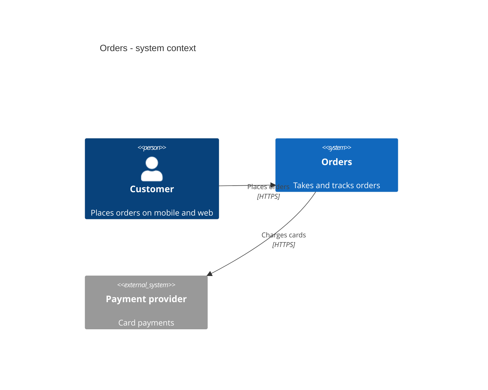
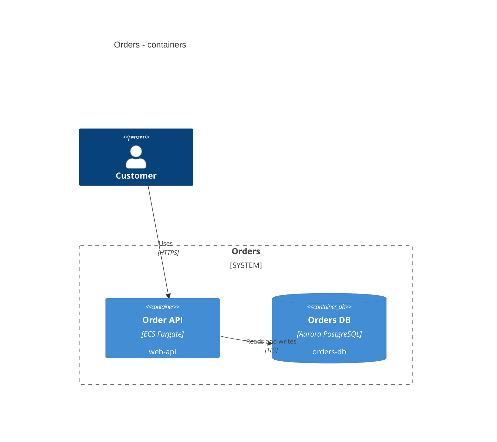

# C4 in Mermaid

`context.mmd` - the system and who uses it:

```mermaid
C4Context
  title Orders - system context
  Person(customer, "Customer", "Places orders on mobile and web")
  System(orders, "Orders", "Takes and tracks orders")
  System_Ext(payments, "Payment provider", "Card payments")
  Rel(customer, orders, "Places orders", "HTTPS")
  Rel(orders, payments, "Charges cards", "HTTPS")
```

`container.mmd` - deployable units inside the system, named like manifest components:

```mermaid
C4Container
  title Orders - containers
  Person(customer, "Customer")
  System_Boundary(orders, "Orders") {
    Container(api, "Order API", "ECS Fargate", "web-api")
    ContainerDb(db, "Orders DB", "Aurora PostgreSQL", "orders-db")
  }
  Rel(customer, api, "Uses", "HTTPS")
  Rel(api, db, "Reads and writes", "TLS")
```
